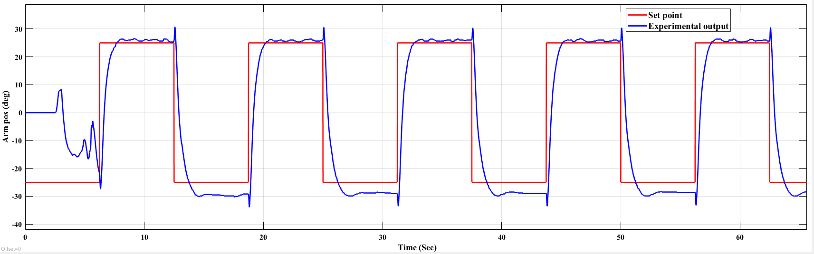
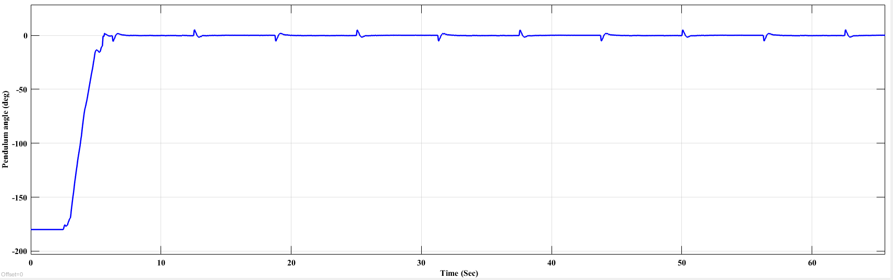

# Linear Quadratic Regulator (LQR)

## Overview

This project implements a Linear Quadratic Regulator (LQR) for the Quanser QUBE-Servo 2 Rotary Inverted Pendulum. The controller is designed using the linearized state-space model to stabilize the pendulum about its unstable upright equilibrium.

---

## Contents

- MATLAB implementation for state-space modeling
- LQR gain computation
- Simulink implementation
- Experimental response plots

---


## Experimental Results

### Rotary Arm Position Tracking



The experimental arm position closely follows the reference trajectory, demonstrating accurate LQR tracking performance.

---

### Pendulum Angle Stabilization



The LQR controller successfully stabilizes the pendulum about the unstable upright equilibrium with minimal oscillations.

## Files

```text
MATLAB/
    Final_Code_LQR.m

Simulink/
    student_lqr_qube.slx

Images/
```

---

## Workflow

State-Space Model

↓

LQR Gain Design

↓

Simulink Validation

↓

Hardware Implementation

---

## Software

- MATLAB
- Simulink
- Control System Toolbox