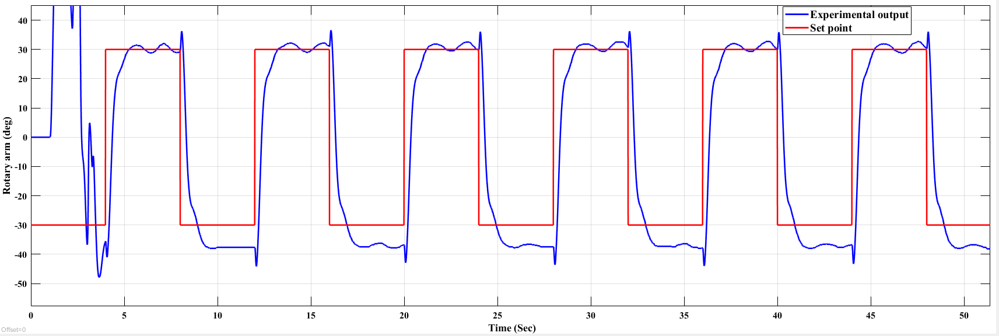
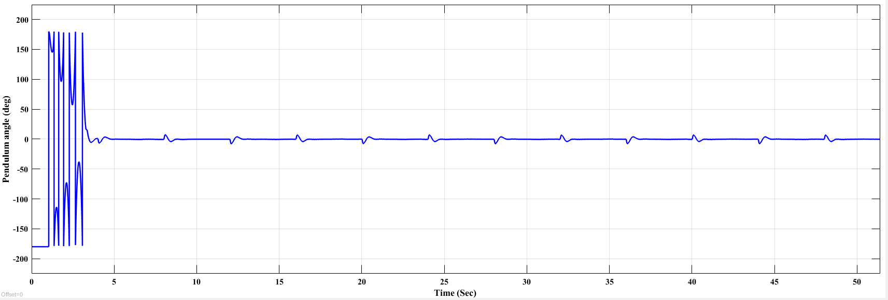

# Rotary Inverted Pendulum (QUBE-Servo 2)

## Overview

This project presents the implementation of control strategies for the Quanser QUBE-Servo 2 Rotary Inverted Pendulum. The experiment is divided into two complementary stages:

- **Part 1:** Linear Quadratic Regulator (LQR) for stabilizing the pendulum about the unstable upright equilibrium.
- **Part 2:** Energy-Based Swing-Up controller to transfer the pendulum from the hanging position to the upright position before switching to the LQR controller for balancing.

Together, these controllers demonstrate the complete control pipeline required for practical inverted pendulum systems.

---

## Objectives

- Develop the state-space model of the rotary inverted pendulum.
- Design an optimal LQR controller for balancing.
- Implement an energy-based swing-up controller.
- Integrate automatic switching between Swing-Up and LQR control.
- Validate the controller through Simulink simulation and hardware experiments.

---

## Repository Structure

```text
02_Rotary_Inverted_Pendulum_Qube/

├── README.md
│
├── Part_1_LQR/
│   ├── MATLAB/
│   ├── Simulink/
│   ├── Images/
│   └── README.md
│
└── Part_2_Swing_Up/
    ├── MATLAB/
    ├── Simulink/
    ├── Images/
    └── README.md
```

---

## Experimental Workflow

```text
System Modeling
      ↓
State-Space Representation
      ↓
LQR Controller Design
      ↓
Energy-Based Swing-Up
      ↓
Automatic Controller Switching
      ↓
Simulink Validation
      ↓
Hardware Implementation
```

---

# Part 1 — Linear Quadratic Regulator (LQR)

The LQR controller stabilizes the pendulum around the unstable upright equilibrium using full-state feedback. The controller gain matrix is computed by minimizing a quadratic performance index, providing an optimal balance between state regulation and control effort.

### Experimental Results

#### Rotary Arm Position


The rotary arm accurately tracks the reference trajectory while maintaining stable closed-loop performance.

---

#### Pendulum Angle


The LQR controller successfully stabilizes the pendulum near the upright equilibrium with minimal oscillations.

---

# Part 2 — Energy-Based Swing-Up Control

The swing-up controller injects energy into the pendulum until it approaches the upright position. Once the pendulum enters the balancing region, control is automatically transferred to the LQR stabilizer, ensuring smooth transition and stable operation.

### Experimental Results

#### Rotary Arm Position



The rotary arm follows the commanded reference while supplying the energy required to swing the pendulum upward.

---

#### Pendulum Angle



The pendulum is successfully swung from the downward equilibrium to the upright position, after which the LQR controller maintains balance.

---

## Topics Covered

- Rotary Inverted Pendulum
- State-Space Modeling
- Linear Quadratic Regulator (LQR)
- Optimal State Feedback Control
- Energy-Based Swing-Up Control
- Hybrid Control Systems
- Simulink Modeling
- Hardware Validation

---

## Software & Tools

- MATLAB
- Simulink
- Control System Toolbox
- Stateflow
- Quanser QUBE-Servo 2

---

## Learning Outcomes

- State-space modeling of nonlinear systems
- Optimal control using Linear Quadratic Regulation
- Energy-based nonlinear control
- Hybrid controller implementation
- Simulink-based validation
- Hardware implementation and experimental verification

---

## References

1. Quanser QUBE-Servo 2 Laboratory Manual
2. Quanser Pendulum State-Space Modeling Workbook
3. Gene F. Franklin, *Feedback Control of Dynamic Systems*
4. Katsuhiko Ogata, *Modern Control Engineering*