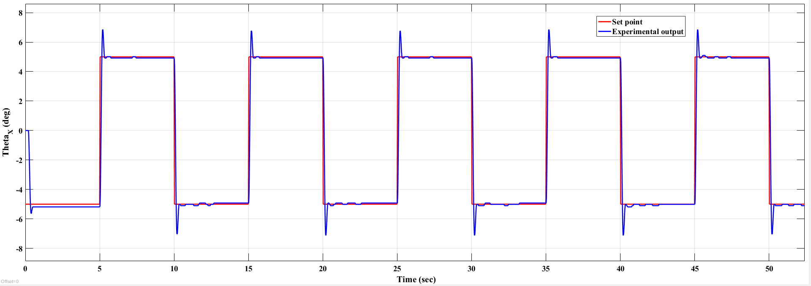
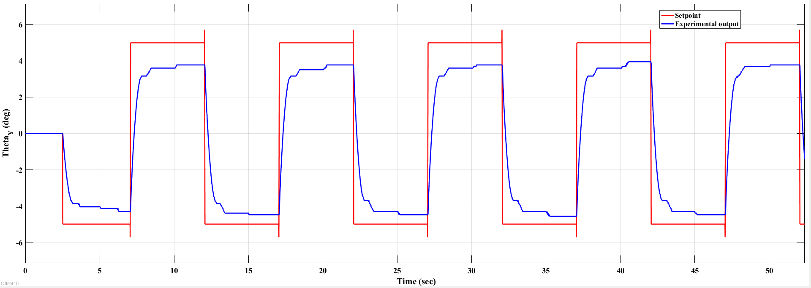

# Linear Quadratic Regulator (LQR)

## Overview

This project implements an optimal Linear Quadratic Regulator (LQR) for the 2-DOF Gantry system. The controller minimizes a quadratic cost function to achieve accurate position tracking while reducing pendulum oscillations and control effort.

---

## Contents

- MATLAB implementation
- State-space modeling
- Controllability verification
- LQR gain computation
- Experimental validation

---

## Files

```text
MATLAB_Code/
    Gantry_LQR_Code.m

Images/
    lqr_gantry_theta_X_group1.png
    lqr_gantry_theta_Y_group1.png
```

---

## Design Workflow

System Modeling

↓

State-Space Representation

↓

Weight Matrix Selection

↓

LQR Gain Computation

↓

Experimental Validation

---

## Experimental Results

### X-Axis Position Tracking



The LQR controller achieves smooth X-axis tracking with reduced overshoot and improved damping.

---

### Y-Axis Position Tracking



The controller provides accurate Y-axis position regulation while minimizing control effort.

---

## Software

- MATLAB
- Control System Toolbox