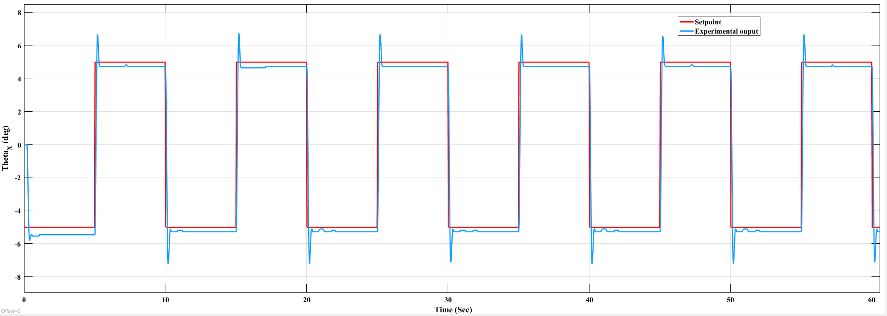
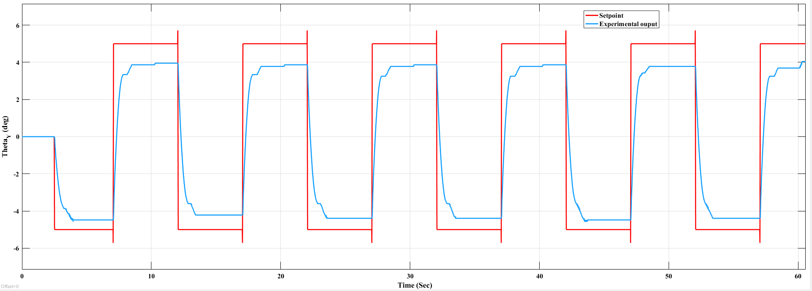
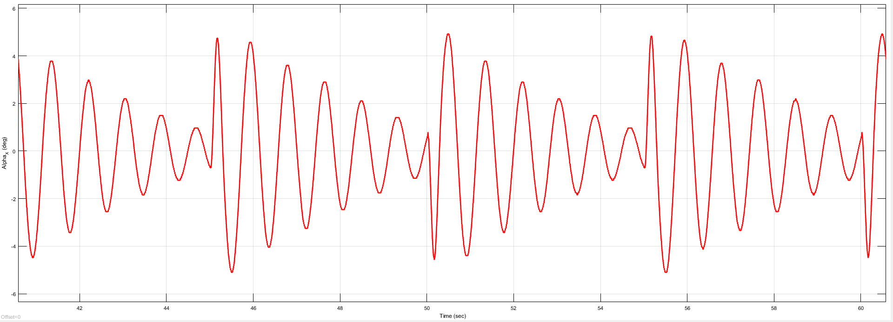
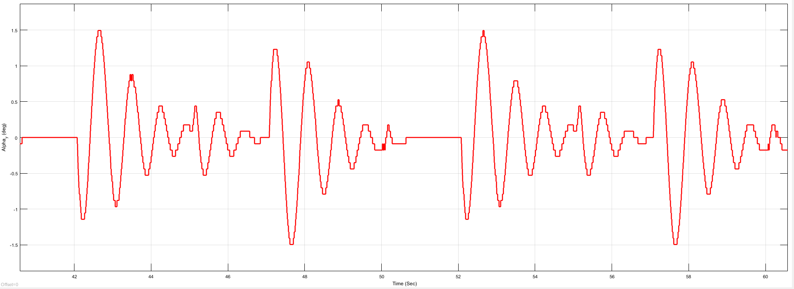

# Pole Placement Control

## Overview

This project implements a state-feedback controller for the 2-DOF Gantry system using the Pole Placement technique. The controller places the closed-loop poles at predefined locations to achieve the desired transient response while minimizing pendulum oscillations during cart motion.

---

## Contents

- MATLAB implementation for state-space modeling
- Controllability verification
- Pole Placement gain computation
- Experimental validation

---

## Files

```text
MATLAB_Code/
    Pole_Placement_Code.m

Images/
    PP_Gantry_Theta_X.png
    PP_Gantry_Theta_Y.png
    PP_alpha_x.png
    PP_alpha_y.png
```

---

## Design Workflow

System Modeling

↓

State-Space Representation

↓

Controllability Verification

↓

Desired Pole Selection

↓

Pole Placement Gain Computation

↓

Experimental Validation

---

## Experimental Results

### X-Axis Position Tracking



The gantry accurately tracks the X-axis reference while maintaining stable closed-loop performance.

---

### Y-Axis Position Tracking



The controller successfully regulates the Y-axis position with minimal steady-state error.

---

### Pendulum Deflection (X-Axis)



The pendulum oscillations remain bounded during X-axis motion and gradually decay.

---

### Pendulum Deflection (Y-Axis)



The controller effectively suppresses pendulum swing during Y-axis tracking.

---

## Software

- MATLAB
- Control System Toolbox