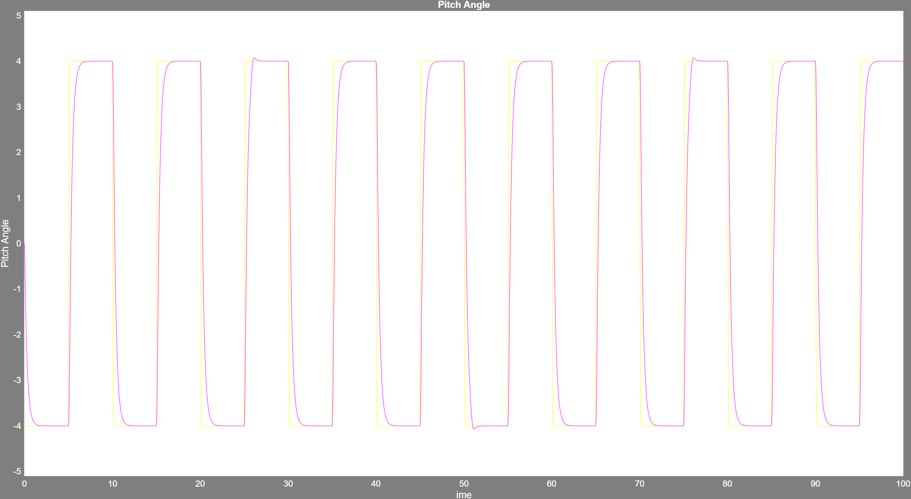
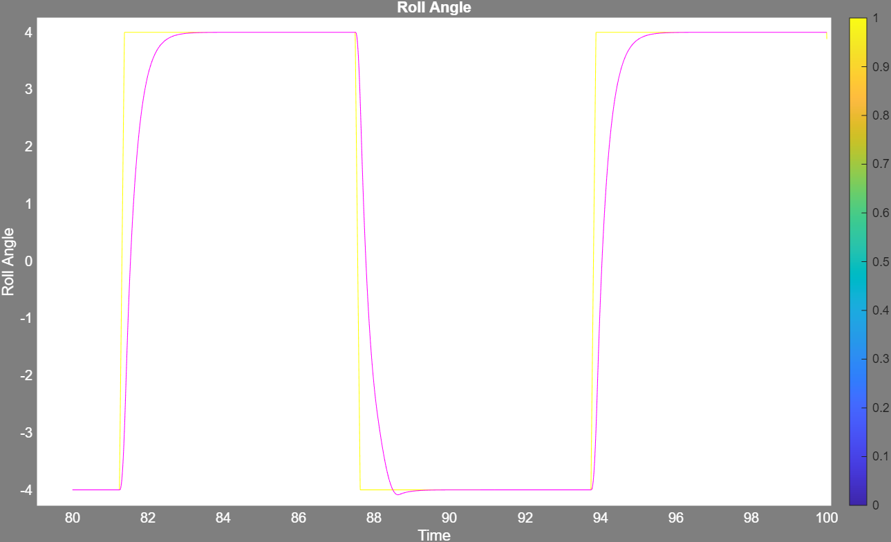
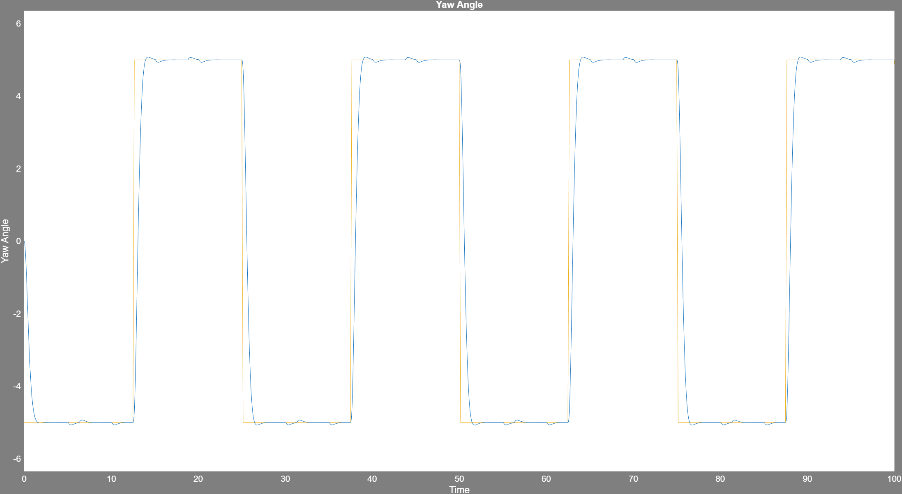

# Linear Quadratic Regulator (LQR)

## Overview

This project implements an optimal Linear Quadratic Regulator (LQR) for the Quanser 3-DOF Hovercraft system. The controller is designed using a linearized state-space model and minimizes a quadratic performance index to achieve accurate attitude tracking while reducing control effort.

The LQR controller simultaneously regulates the hovercraft's **pitch, roll, and yaw** dynamics using full-state feedback.

---

## Contents

- State-space modeling of the 3-DOF Hovercraft
- Controllability verification
- LQR controller design
- Weight matrix selection
- Experimental validation

---

## Files

```text
MATLAB/
    Final_Code.m

Images/
    Pitch_Angle_LQR.png
    Roll_Angle_LQR.png
    Yaw_Angle_LQR.png

s_hover.mdl
```

---

## Design Workflow

Hovercraft Dynamics

↓

State-Space Modeling

↓

Controllability Analysis

↓

Selection of Q and R Weight Matrices

↓

LQR Gain Computation

↓

Simulink Implementation

↓

Experimental Validation

---

## Experimental Results

### Pitch Angle Response



The LQR controller accurately tracks the commanded pitch angle with fast settling time and minimal overshoot.

---

### Roll Angle Response



The roll response demonstrates stable closed-loop regulation with smooth transient behavior.

---

### Yaw Angle Response



The yaw controller provides accurate reference tracking while maintaining stable system dynamics.

---

## Software

- MATLAB
- Simulink
- Control System Toolbox

---

## Topics Covered

- State-Space Modeling
- Optimal Control
- Linear Quadratic Regulator (LQR)
- Controllability Analysis
- Hovercraft Dynamics
- Simulink Modeling