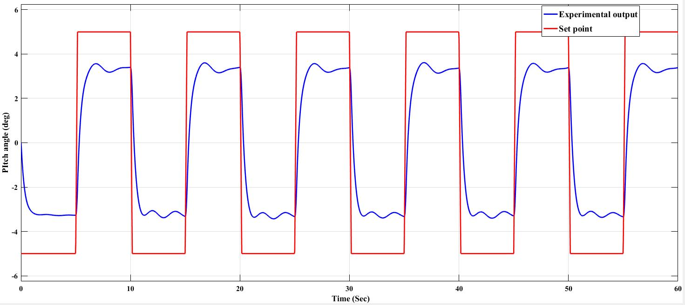
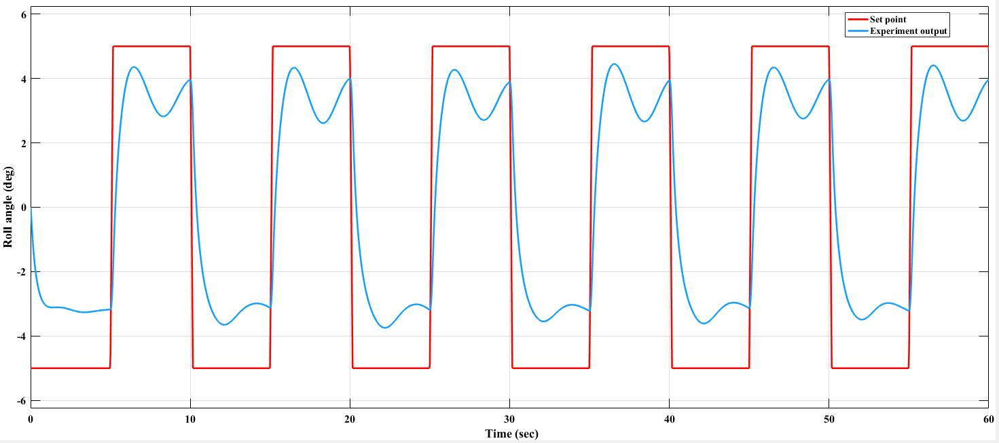
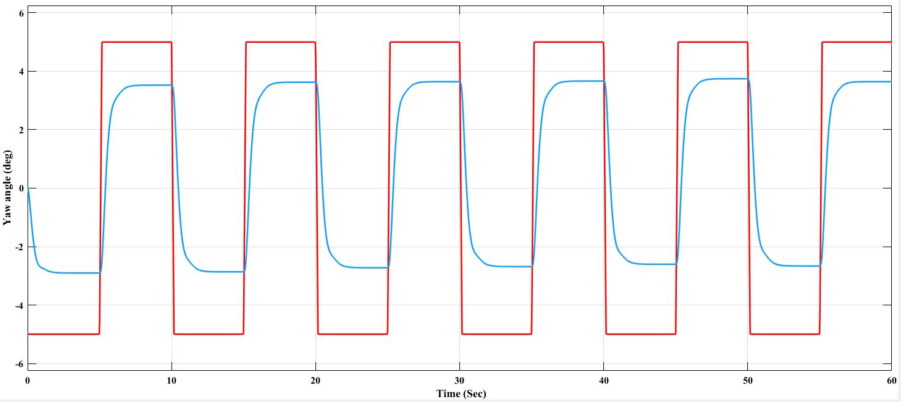

# Linear Quadratic Gaussian (LQG) Control

## Overview

This project implements a Linear Quadratic Gaussian (LQG) controller for the Quanser 3-DOF Hovercraft. The controller combines an optimal LQR state-feedback controller with a Kalman Filter observer to estimate system states in the presence of measurement uncertainty.

The observer-based controller provides robust tracking performance while reducing the effects of process and measurement noise.

---

## Contents

- State-space modeling
- Observability verification
- Kalman Filter design
- LQR controller synthesis
- Observer-based state estimation
- Experimental validation

---

## Files

```text
MATLAB/
    Final_Code_LQG.m

Images/
    lqg_pitch.jpg
    lqg_roll.jpg
    lqg_yaw.jpg

s_hover_lqg_1.slx
```

---

## Design Workflow

Hovercraft Dynamics

↓

State-Space Modeling

↓

Observability Analysis

↓

Kalman Filter Design

↓

LQR Controller Design

↓

Observer-Based State Feedback

↓

Experimental Validation

---

## Experimental Results

### Pitch Angle Response



The observer-based controller accurately tracks the desired pitch angle while effectively filtering measurement noise.

---

### Roll Angle Response



The Kalman Filter improves state estimation, resulting in smoother roll-angle regulation.

---

### Yaw Angle Response



The LQG controller achieves stable yaw tracking using estimated system states and optimal feedback control.

---

## Software

- MATLAB
- Simulink
- Control System Toolbox

---

## Topics Covered

- Linear Quadratic Gaussian (LQG)
- Kalman Filter
- State Estimation
- Observer Design
- Optimal Control
- Hovercraft Dynamics